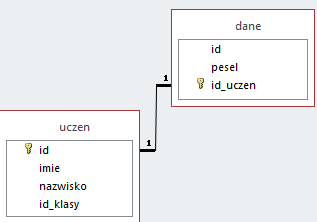
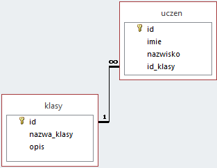
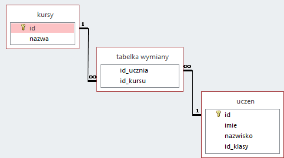

# SQL
#### 23.09.2022

## Typy łączenia danych :

    używamy ich do identyfikowania danych :

- 1 : 1 (jeden do jednego) - wiele rekordów może pasować do jednego rekordu,

np. wielu uczniów może chodzić do jednej klasy, oraz dzięki temu sekretarka nie może wpisać ucznia do nie istniejącej klasy.

- 1 : ∞ (jeden do wielu) - jeden rekord może zostac przypisany do wielu pul,

np. jeden adres może należeć do kilku osób.

- ∞ : ∞ (wiele do wielu) - z pomocą tabeli z wymianą danych możemy przypisać wiele informacji do wilu osób,

np. jedna osoba może chodzić na kilka kursów a ktoś inny może uczęszczać na dokładnie to samo.

## Typy danych
- Liczbowe,
    - INTIGER,
        - int - 32 bitów,
        - smallint - 16 bitów,
        - bigint - 64 bitów,
        - mediumint - 24 bitów,
        - tinyint - 8 bitów,
    - FLOAT i DOUBLE - liczby zmienno przecinkowe,
- Data i czas,
    - TIME - godzina,
    - DATE - data,
    - TIMESTAMP - data i godzina,
- Łańcuchowe - przechowywanie łańcuchów znaków ( tekstów ),
    - char(ilość znaków) - uzupełnia puste pola spacjami ( używać w ustalonej z góry ilościami danych )[ stały - szybszy ],
    - varchar(ilość znaków)[ dynamiczny - wolniejszy ].

